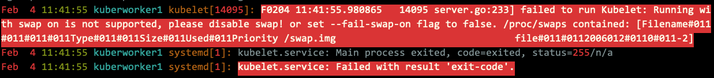

# Troubleshoot Clusters

### Unable List my Cluster

The first thing to debug in your cluster is if your nodes are all registered correctly.

Run

```bash
kubectl get nodes
```

And verify that all of the nodes you expect to see are present and that they are all in the `Ready` state.

###  Verify the logs

```bash
devuser@kuberworker1:~$ view /var/log/syslog
```



