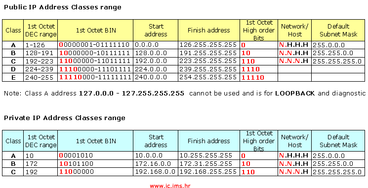

# Public and Private IP address Range

 All for now available **IP address** \(Public or Private IP address classes range\) are arranged in groups. One network IP address \(depending on which group belongs\) can contain multiple IP addresses \(the host address\). Let's look at the group \(class\) addresses shown below Figure. 

In these three IP addresses classes \(groups\) we have a division so that each group have **private IP addresses** that are intended for use in our **IT networks**. Furthermore, we can observe that these groups have a specific range of IP addresses From-To.   
  
You can see the tracks in **binary format** \(BIN\). An important part of this review in Figure2 is the second to last column in which we can see the **Dotted IP address** denoted by the letter **N** and **H** \(for better understanding\) for each class A, B and C and the same shows which parts \(bytes\) of IP addresses intended for network and are intended for hosts \(remember, '**Host**' is the name of the computer\) and these labels are closely related to the network mask that is part of a complete **IP addressing and Subnetting** important for the network.   
  
I want to explain the last column in Figure2.   
Default \(standard\) **Network Mask** is again written in **decimal notation** separated by dots \(each 'DEC' notation in binary form, so again we have four bytes\).   
  
This is an example of an IP address that has an IP address and network mask   
**IP address: 192.168.1.65   
Default Network Mask: 255.255.255.0**   
  
Here we ourselves can we ask a few questions.   
Is it the IP address of a network, or a computer in a network?   
Why this combination?   
  
My explanation, Because, from the table in the picture above Figure2, we see that the **IP addresses 192.168.1.65** belongs to the class C and with it even for private class range. In the same row in the last column, we see that for the scope of the IP address belongs to a default mask 255.255.255.0   
  
**N = Network   
H = Host**   
  
For all pre-written text I can display that **N.N.N.H = 255.255.255.0**  
This notation will better be able to understand if you look at the next page [link number 5 on Content of this Blog.](http://vlsm-subnetting.blogspot.com/2014/09/introduction-to-vlsm-and-subnetting-lan.html)  
Let's go to the next page tutorial.

